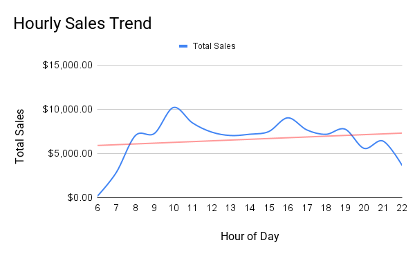
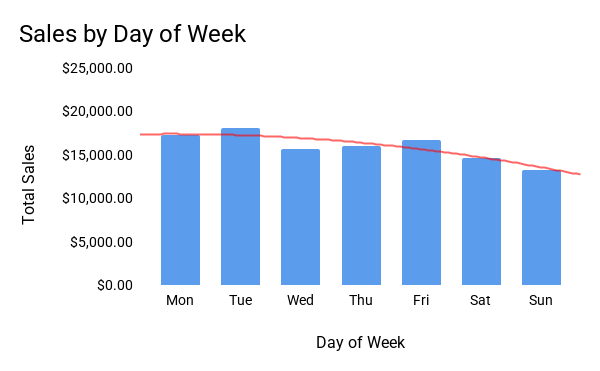
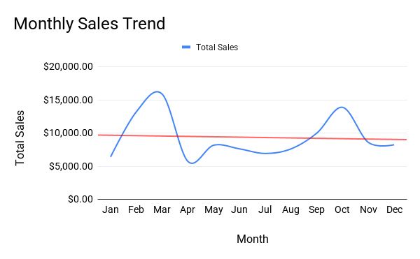
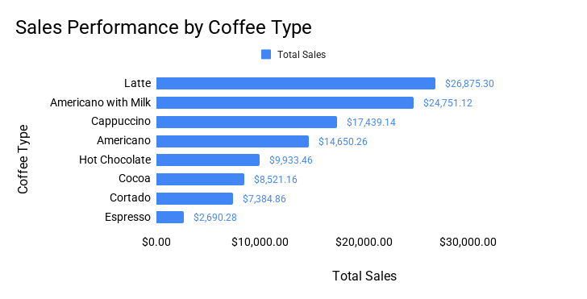
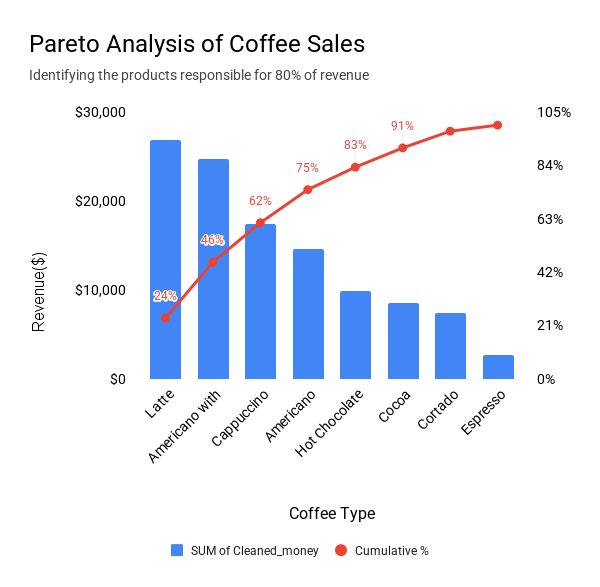

# Coffee Shop Sales Analysis 

---

## End-to-End Case Study
*From Raw Data to Clean Data, Visualizations, Insights, and Strategic Actionable Recommendations*

### Dataset Source

- Origin : Kaggle Dataset
- Format : CSV
- Imported into : **SQL Server Management Studio (SSMS)**
- Total Rows : `3547` 
- Total Columns : `11` 
- Raw Data - [Raw Coffee Shop Sales CSV](data/Coffee_shop_sales.csv)

### Quick Links
- Cleaned Data - [Cleaned Coffee Shop Sales CSV](data/Coffee_shop_sales_cleaned.csv)
- Rationale - [Data Cleaning Step By Step Logic Workflow](documentation/SQL%20Data%20Cleaning%20Logic%20Workflow.md)
- SQL Scripts - [Exploratory Cleaning Scrpt](SQL/Exploratory_Data_Cleaning_script.sql) & [Final SELECT Script](SQL/FINAL_SELECT_Script.sql)

---

## Executive Summary
This case study demonstrates a complete, end-to-end analytics workflow using a fictional coffee shop's transactional data. The project follows a realistic corporate process from importing raw data, cleaning and preparing it in SQL, creating analysis-ready tables, and building insightful visualizations in Google Sheets and Power BI.

---

#### Objective:

- To understand customer purchasing behavior across different time periods and product categories in order to improve revenue, operational efficiency, and data-driven decision-making.

#### Approach:

- Inspect, clean, standardize, and validate all columns in SQL Server (date formats, time fields, product names, payment types, hour-of-day, weekday, month, product-type)
- Export the cleaned dataset for visualization.
- Build trend charts and performance dashboards to uncover actionable insights.

#### Business Impact
- Insights from this case study help the coffee shop optimize staffing schedules, promotional timing, inventory planning, and menu strategy. These patterns directly guide decisions and reduce operational inefficiencies and improve overall profitability.

#### Business Goals

- **Increase revenue** I will achieve this by focusing on the highest-opportunity time periods and products.
- **Improve operational efficiency** I will achieve this by aligning staffing and inventory with real demand patterns.
- **Support better marketing decisions** I will achieve this by suggesting timing promotions and offers when they are likely to have the most impact.

---

### Technical Skills Used
##### **SQL Skills Used:**
`SELECT` `DISTINCT` `FROM` `WHERE` `INTO` `TRIM` `TRY_CONVERT` `IS NULL` `NULLIF` `UPPER/LOWER` `CTE` `CASE WHEN`

##### **Google Sheet Skills Used:**
  - Data filters and formatting
  - Pivot tables
  - Line, Bar, Column & Pareto Charts
  - Dashboard thinking
 
##### **Mark up language Skills Used:**
  - Markdown Syntax - For creating structured documentation and formatting text for clarity and readability.
  - Jupyter Lab - To write and render the markdown `(.md)` file and preview the project's end-to-end workflow documentation quality.
  - GitHub - To upload this case study complete with SQL script, documentation and logic behind analysis workflow as part of my portfolio.

---

### Core Analytical Questions

1. **When do customers buy?**
   - Which **hours of the day** generate the highest and lowest sales?
   - Which **days of the week** are strongest and weakest for revenue?
   - How does **monthly performance** change across the year?

<!-- just a blank line with indentation -->

2. **What do customers buy?**
   - Which **coffee products** sell the most in terms of volume?
   - Which products generate the most **revenue**, not just orders?
   - Are there any products that underperform and may need promotion or review?

<!-- just a blank line with indentation -->

3. **How do customers pay?**
   - What is the split between **cash and card** payments?
   - Are there patterns by time of day or day of week that affect payment method?

<!-- just a blank line with indentation -->

4. **How should the business respond?**
   - Where are the **biggest opportunities** to increase sales?
   - Which time periods and products should be prioritised for **promotions, staffing, or menu changes**?
   - Are there weaker periods that could be improved with targeted campaigns or operational adjustments?

---

## Visualization
With the cleaned dataset exported into Excel, the next phase involved building visualizations that highlight key business trends. These charts and summaries that allow stakeholders to understand customer patterns, peak hours, product performance, and overall revenue behavior. This section documents the visualization steps and the insights gained from the data. 

---

#### 1. Hourly Sales Trend
- **Business Question:** When are customers most likely to buy coffee during the day?
- **Purpose:** Identify peak sales hours to optimize staffing and promotions.
- **Key Fields:** `hour_of_day` `Cleaned_money`
- **Chart Type:** Line chart  

---

##### **Insights**
+ Customer demand rises sharply from 7 AM, driven by morning commuters, and peaks around 10 AM, making late morning the strongest revenue window.
+ After the peak period, sales gradually decline through midday, leveling out but remaining fairly steady between 12 PM - 3 PM.
+ A smaller secondary lift occurs around 4-5PM, reflecting after-work purchase or evening pick-me-ups.
+ Revenue drops consistently after 6 PM, suggesting limited demand in the late evening.

##### **Recommendation**
+ Prioritize staffing and inventory from **7 AM - 11 AM**, ensuring fast service during the highest-traffic hours.
+ Consider morning-focused promotions (e.g. bundle deals, loyalty bonuses before 11 AM).
+ Maintain moderate staffing through early afternoon, then scale down after **6 PM** to reduce unnecessary labor costs.
+ Explore a small **4-5 PM** promotion ("Afternoon Boost Offer") to strengthen the minor peak and drive incremental revenue.
  
---

#### 2. Sales by Day of Week
- **Business Question:** Which days are busiest, and which days underperform?
- **Purpose:** Support weekly scheduling, promotions, or loyalty campaigns. 
- **Key Fields:** `Weekday` `Cleaned_money`
- **Chart Type:** Column chart 

---

##### **Insights**
- It is observed that **Tuesday** consistently delivers the highest revenue, followed closely by **Monday** and **Friday**, making these the strongest days overall.
- **Saturday** shows visible drop in sales, and **Sunday** performs the weakest of all days. This indicates lower weekend footfall.
- Mid-week days (**Wednesday** and **Thursday**) remain stable with moderate sales.

##### **Recommendation**
- Load higher staffing on **Tuesday** and **Friday**, particularly during peak morning hours.
- Introduce **mid-week** or **weekend-targeted promotions** to improve lower performing days revenue. (e.g. weekend family bundles, loyalty double-points on Sunday).
- Consider weekday-focused marketing, as weekday commuter behavior appears to drive most of the business activity.
- Re-evaluate operational hours on **Sunday** - If demand continues to remain low, a shortened schedule could optimize labour costs. 

---

#### 3. Monthly Sales Trend
- **Business Question:** Are there seasonal or month-to-month patterns?
- **Purpose:** Support forecasting and inventory planning.
- **Key Fields:** `Month_name` `Cleaned_money`
- **Chart Type:** Line chart  

---

##### **Insights**
- Sales show strong seasonality: **March** and **October** are the highest-performing months, suggesting seasonal spikes tied to weather changes or promotional cycles.
- **April** experiences a noticeable drop after March’s peak, potentially indicating post-holiday slowdowns or weather-shift effects.
- The warmer summer months **June-August** show a slight dip but remain stable, then rise again towards early autumn.
- **December** is relatively weak compared to other months, possibly due to holiday closures, reduced commuting, or shift to alternative beverage types.

##### **Recommendation**
- Plan major promotions, product launches, or loyalty campaigns in **March** and **October** to capitalize on already strong months.
- Introduce Spring and Easter promotions in **April** to counteract the drop following March’s peak.
- Consider seasonal menu items (e.g. iced drinks in summer, spiced drinks in autumn) to smooth seasonal dips.
- Evaluate **December** performance and consider targeted holiday offerings, or adjust scheduling/staffing to match lower demand.

---

#### 4. Sales Performance by Coffee Type
- **Business Question:** What products drive the most revenue?
- **Purpose:** Guide product mix, pricing, and inventory decisions.
- **Key Fields:** `Cleaned_coffee_name` `Cleaned_money`
- **Chart Type:** Bar chart

---

##### **Insights**
- **Latte** is the clear top performer, generating the **highest total revenue** and accounting for the largest share of product sales. This suggests its the core anchor product for the coffee shop.
- **Americano with Milk** is the second-strongest product, not far behind Latte, indicating strong demand for slightly richer, milk-based variations.
- Cappuccino and Americano form a solid middle tier of products, together contributing towards a meaningful portion of total sales and offering variety across milk-heavy and more traditional espresso-based options.
- Hot chocolate, Cocoa and Cortado contributes smaller but still notable revenue, likely appealing to more niche segments (non-coffee drinkers, chocolate lovers)
- Espresso is the weakest performer by revenue, contributing the smallest share. This could reflect a smaller target segment, lower price point, or customers preferring milk-based drinks over straight espresso. 

##### **Recommendation**
- Treat Latte as a hero product: keep it highly visible on menus, use it in promotional banners, and ensure its never out of stock (beans, milk, and flavor add-ons).
- Run targeted experiments such as "Latte of the Month" or seasonal flavored Lattes (e.g. pumpkin spice, hazlenut, ginger-bread, caramel, vanilla, mocha) to further leverage the strongest category and potentially increase average ticket size. 
- Use Americano with Milk, Cappuccino, and Americano in bundle deals or "recommended alternatives" to nudge customers toward higher-margin items within this strong performing group.
- For lower performing drinks (Hot Chocolate, Cocoa, Cortado), review pricing and margins:
    - If margins are healthy, keep them as ***niche offerings*** to maintain variety and customer satisfaction.
    - If margins are weak, consider simplifying options, limiting preparation time, or running limited-time flavors to test whether demand can be lifted.
- For Espresso consider increasing price point due to the observation of only 129 sold throughout the year and Avg Price charged per drink was the lowest compared to other drinks. Best to recalculate pricing and margins for espresso as well.

---

#### 5. Payment Method Breakdown (Cash vs Card)**
- **Business Question:** How do customers prefer to pay?
- **Purpose:** Understand payment behaviors that influence checkout flow, staffing, and POS strategy.
- **Key Fields:** `cash_type`
- **Chart Type:** ***Not visualized - single-category data***

---

##### **Insights** 

Because all transactions fall under one category, a visualization would not add meaningful insight.

##### **Recommendation**
- Confirm whether the business truly operates as card-only.
If yes, document this policy in reporting and dashboards.
- **If cash is accepted but missing in the dataset, investigate data capture gaps in the POS system to prevent misreported revenue and inaccurate financial analysis.**
- If expanding to new locations, evaluate whether card-only service may impact accessibility or customer experience depending on the customer base. 

---

# Executive Conclusion & Core Recommendations
## The 80/20 Pareto Analysis Final Breakdown

#### **Pareto Analysis of Coffee Sales (Cumulative Revenue Distribution)**
**Key Fields:** `Cleaned_coffee_name` `% of Total Revenue` `Cumulative % of Revenue`

**Chart Type:** Combo chart **(Pareto)**

    - Bars - Revenue by coffee type
    - Line - Cumulative percentage of total revenue

The Pareto Analysis serves as the strategic culmination of this case study, integrating the insights from hourly, daily, monthly, and product-level performance into a unified, business-focused understanding of revenue drivers. While earlier visualizations identified patterns in customer behaviour, sales trends, and highlighted top-selling products, the Pareto approach reframes these findings in terms of **impact** ; quantifying which items truly sustain the business and where operational focus yields the greatest return.

The cumulative revenue curve reveals a clear 80/20 pattern: A small group of core coffee products specifically *Latte, Americano with Milk, Cappuccino, and Americano* accounts for up to **80%** of the total revenue. The sharp rise in the early portion of the curve and the subsequent flattening illustrate the distinction between the ***vital few*** (80% of revenue generator) products that drive financial performance and the ***useful many*** (20% of revenue generator) products that contribute incrementally. 
> ***This insight is critical for operational efficiency and provides a deeper layer of understanding beyond simple sales ranking.***

From a strategic perspective, these findings serve as a decision-making framework for the café’s commercial and operational priorities. 
> ***The high-impact products should be prioritised across staffing, inventory planning, preparation standards, menu design, and promotional focus.***

Enhancing the performance of these items, whether through pricing optimisation, improved service speed, or targeted promotional offers will yield the greatest potential return. By contrast, lower-volume drinks such as Cortado, Cocoa, and Espresso should be evaluated for potential menu simplification, seasonal rotation, or repositioning to reduce operational waste without compromising customer choice.

This 80/20 breakdown elevates the analysis from descriptive reporting to actionable strategic guidance. By identifying where the business derives most of its value, the Pareto method provides clarity on resource allocation and operational focus. 

To conclude, in addition to the Pareto Analysis, the time-based analyses reinforced these findings by highlighting where operational alignment can further support revenue performance:

- [x] **The hourly sales trends** demonstrated a clear concentration of demand during the morning commute period, indicating that staffing, inventory readiness, and service efficiency should be strategically weighted toward the 7 AM - 11 AM window.

- [x] **The day-of-week patterns** emphasised the significant need for strengthened operational coverage on Tuesday and Friday; highlighting the importance of aligning staffing and inventory with peak weekday demands while using targeted promotions mid-week to improve lower-traffic weekdays, and adjusted Sunday hours to optimise labour costs.

- [x] **Monthly trends** revealed predictable seasonal surges, underscoring the value of proactive stock management, promotional planning, and capacity adjustments during high-demand periods.

Together, these temporal insights provide a focused operational structure outline that complements the Pareto findings—enabling the café to allocate resources where they have the greatest impact on customer experience and revenue outcomes.
It also establishes a repeatable analytical framework for future data-driven decisions, ensuring that the café continues to prioritise the products and actions that most directly support revenue growth and operational efficiency.

---

### Analytical Skills Demonstrated 
Revenue driver identification (Pareto 80/20)  
Time-based trend interpretation (hour/day/month)  
Product performance evaluation  
Strategic insight generation Operational decision support  
Turning data into clear, actionable insights

---

### Contact
**Sabira Alimahomed**  
Aspiring Data Analyst - based in Liverpool, UK  
Email: hidden for privacy  
GitHub: https://github.com/sabira-analytics
